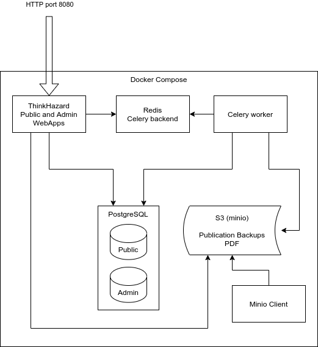

# ThinkHazard

A natural hazard screening tool for disaster risk management project planning. ThinkHazard! is maintained by the Global Facility for Disaster Reduction and Recovery (GFDRR). Provides classified hazard level (very low to high) for any location in the world, and advice on managing disaster risk, plus useful reports and contacts, for 11 natural hazards. 

API instructions can be found here: https://github.com/GFDRR/thinkhazard/blob/master/API.md 

[](https://travis-ci.org/GFDRR/thinkhazard)

## Schema

Here is the schema of the development architecture based on Docker Compose:



For production see: [Production schema](doc/schema-prod.png)

## Getting Started

The following commands assume that the system is Debian/Ubuntu. Commands may need to be adapted when working on a different system.

Build docker images:

    $ make build

Run the composition:

    $ docker-compose up -d
    $ make initdb

Now point your browser to <http://localhost:6543>.

Run checks and automated tests:

    $ make check test

## Initialize a fresh database

Install postgres `unaccent` extension database engine :

    $ sudo apt install postgresql-contrib

Edit `/etc/postgresql/9.5/main/postgresql.conf`, and set `max_prepared_transactions` to 10

Create a database:

    $ sudo -u postgres createdb -O www-data thinkhazard_admin
    $ sudo -u postgres psql -d thinkhazard_admin -c 'CREATE EXTENSION postgis;'
    $ sudo -u postgres psql -d thinkhazard_admin -c 'CREATE EXTENSION unaccent;'
    $ sudo -u postgres createdb -O www-data thinkhazard
    $ sudo -u postgres psql -d thinkhazard -c 'CREATE EXTENSION postgis;'
    $ sudo -u postgres psql -d thinkhazard -c 'CREATE EXTENSION unaccent;'

If you want to use a different user or different database name, you’ll have to provide your own configuration file. See “Use local.ini” section below.

Create the required schema and tables and populate the enumeration tables:

    $ make populatedb

Note: this may take a while. If you don’t want to import all the world administrative divisions, you can import only a subset:

    $ make populatedb DATA=turkey

or:

    $ make populatedb DATA=indonesia

In order to harvest geonode instance with full access, you need to create and
configure an API key.
On geonode side:

* create a superuser with following command:

    $ python manage.py createsuperuser

* Then, create api keys for all users with:

    $ python manage.py backfill_api_keys

* Finally, you can display all api keys with:

```sql
SELECT people_profile.id, username, key
FROM people_profile
LEFT JOIN tastypie_apikey ON (tastypie_apikey.user_id = people_profile.id)
```

On Thinkhazard side:

* Change username and api_key value according to previous setup in
`thinkhazard_processing.yaml` file.

You’re now ready to harvest, download and process the data:

    $ make harvest
    $ make download
    $ make complete
    $ make process
    $ make decisiontree

For more options, see:

    $ make help

## Processing tasks

Administrator can also launch the different processing tasks with more options.

`.build/venv/bin/harvest [--force] [--dry-run]`

Harvest metadata from GeoNode, create HazardSet and Layer records.

`.build/venv/bin/download [--title] [--force] [--dry-run]`

Download raster files in data folder.

`.build/venv/bin/complete [--force] [--dry-run]`

Identify hazardsets whose layers have been fully downloaded, infer several fields and mark these hazardsets complete.

`.build/venv/bin/process [--hazardset_id ...] [--force] [--dry-run]`

Calculate output from hazardsets and administrative divisions.

`.build/venv/bin/decision_tree [--force] [--dry-run]`

Apply the decision tree followed by upscaling on process outputs to get the final relations between administrative divisions and hazard categories.

## Publication of admin database on public site

Publication consist in overwriting the public database with the admin one. This can be done using :

`make publish`

And this will execute as follow :
 * Lock the public site in maintenance mode.
 * Store a publication date in the admin database.
 * Backup the admin database in archives folder.
 * Create a new fresh public database.
 * Restore the admin backup into public database.
 * Unlock the public site from maintenance mode.

### Configure admin username/password

By default, the admin interface authentification file is `/var/www/vhosts/wb-thinkhazard/conf/.htpasswd`. To change the location you can set `AUTHUSERFILE` on the `make modwsgi` command line.

To create a authentification file `.htpasswd` with `admin` as the initial user :

    $ htpasswd -c .htpasswd admin

It will prompt for the passwd.

Add or modify `username2` in the password file `.htpasswd`:

    $ htpasswd .htpasswd username2

### Analytics

If you want to get some analytics on the website usage (via Google analytics), you can add the tracking code using a analytics variable:

    analytics = UA-75301865-1

### Feedback

The `feedback_form_url` can be configured in the `local.ini` file.

### Configuration of processing parameters

The configuration of the threshold, return periods and units for the different hazard types can be done via the thinkhazard\_processing.yaml.

After any modification to this file, next harvesting will delete all layers, hazardsets and processing outputs. This means that next processing task will have to treat all hazardsets and may take a while (close to one hour).

## hazard\_types

Harvesting and processing configuration for each hazard type. One entry for each hazard type mnemonic.

Possible subkeys include the following:

-   `hazard_type`: Corresponding hazard\_type value in geonode.
-   `return_periods`: One entry per hazard level mnemonic with corresponding return periods. Each return period can be a value or a list with minimum and maximum values, example:

    ```yaml
    return_periods:
      HIG: [10, 25]
      MED: 50
      LOW: [100, 1000]
    ```

-   `thresholds`: Flexible threshold configuration.

    This can be a simple and global value per hazardtype. Example:

    ```yaml
    thresholds: 1700
    ```

    But it can also contain one or many sublevels for complex configurations:

    1.  `global` and `local` entries for corresponding hazardsets.
    2.  One entry per hazard level mnemonic.
    3.  One entry per hazard unit from geonode.

    Example:

    ```yaml
    thresholds:
      global:
        HIG:
          unit1: value1
          unit2: value2
        MED:
          unit1: value1
          unit2: value2
        LOW:
          unit1: value1
          unit2: value2
        MASK:
          unit1: value1
          unit2: value2
      local:
        unit1: value1
        unit2: value2
    ```

-   `values`: One entry per hazard level, with list of corresponding values in preprocessed layer. If present, the layer is considered as preprocessed, and the above `thresholds` and `return_periods` are not taken into account. Example:

    ```yaml
    values:
      HIG: [103]
      MED: [102]
      LOW: [101]
      VLO: [100, 0]
    ```

## Translations

ThinkHazard! is translated using `Transifex`.

### Workflow ###

We use lingua to extract translation string from `jinja2` templates.

Use the following command to update the gettext template (`.pot`):

    make extract_messages

Note: this should be done from the production instance ONLY in order to have
the up-to-date database strings extracted!
You will have to make sure that the `~/.transifexrc` is valid and the
credentials correspond to the correct rights.

Then you can push the translation sources to transifex.

    make transifex-push

Once the translations are OK on Transifex it's possible to pull the translations:

    make transifex-pull

Don't forget to compile the catalog (ie. convert .po to .mo):

    make compile_catalog

### Development

There are 3 different ways to translate strings in the templates:

 - `translate` filter

   This should be used for strings corresponding to enumeration tables in
   database.

```
{{ hazard.title | translate }}
```

 - `gettext` method

   To be used for any UI string.

```
{{gettext('Download PDF')}}
```

 - model class method

   Some model classes have specific method to retrive the value from a field
   specific to chosen language.

```
{{ division.translated_name(request.locale_name)}}
```
