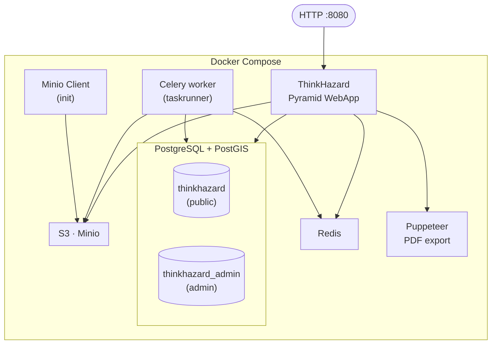

# ThinkHazard!

A natural hazard screening tool for disaster risk management project planning.
ThinkHazard! is maintained by the [Global Facility for Disaster Reduction and Recovery (GFDRR)](https://www.gfdrr.org).

It provides classified hazard levels (very low to high) for any location in the world, along with risk management advice, reports, and contacts for 11 natural hazards.

**Live site:** [thinkhazard.org](http://thinkhazard.org/) &nbsp;|&nbsp; **API docs:** [gfdrr.github.io/thinkhazard/api](https://gfdrr.github.io/thinkhazard/api/) &nbsp;|&nbsp; **License:** GPL-3.0

---

## Table of contents

- [Architecture](#architecture-docker-compose)
- [Getting Started](#getting-started)
- [Populate the admin database](#populate-the-admin-database)
- [Publication](#publication-of-admin-database-on-public-site)
  - [Admin username/password](#configure-admin-usernamepassword)
  - [Analytics](#analytics)
  - [Feedback](#feedback)
- [Translations](#translations)
- [Debugging with VS Code](#debugging-with-vs-code)

---

## Architecture (Docker Compose)

All services run locally inside a Docker Compose stack:


```mermaid
flowchart TB
    HTTP(["HTTP :8080"])

    subgraph compose["Docker Compose"]
        direction TB
        APP["ThinkHazard\nPyramid WebApp"]
        CELERY["Celery worker\n(taskrunner)"]
        REDIS["Redis"]
        PUPPETEER["Puppeteer\nPDF export"]

        subgraph pg["PostgreSQL + PostGIS"]
            PUB[("thinkhazard\n(public)")]
            ADM[("thinkhazard_admin\n(admin)")]
        end

        subgraph s3["S3 · Minio"]
        end

        MC["Minio Client\n(init)"]
    end

    HTTP --> APP
    APP --> pg
    APP --> REDIS
    APP --> PUPPETEER
    APP --> s3
    CELERY --> REDIS
    CELERY --> pg
    CELERY --> s3
    MC --> s3
```

| Service | Role |
|---|---|
| **thinkhazard** | Pyramid web application — public site + admin interface, served on port 8080 |
| **taskrunner** | Celery worker — runs async tasks: publish, geopackage import, transifex sync |
| **db** | PostgreSQL + PostGIS — two databases: `thinkhazard` (public/live) and `thinkhazard_admin` (staging) |
| **redis** | Celery message broker |
| **puppeteer** | Headless Chrome service for PDF report generation |
| **minio** | S3-compatible object store for publication backups, PDF reports, and task logs |
| **minio-client** | Init container that creates the S3 bucket on first startup |

## Getting Started

The following commands assume that the system is Debian/Ubuntu. Commands may need to be adapted when working on a different system.

Build docker images:

```bash
make build
```

Run the composition:

```bash
docker compose up -d
make initdb
```

Now point your browser to <http://localhost:8080>.

Run checks and automated tests:

```bash
make check test
```

## Populate the admin database

Create the required schema and tables and populate the tables in admin database:

```bash
GPKG=path_to_geopackage_file make populatedb
```

Note: this may take a while.

## Publication of admin database on public site

Publication consist in overwriting the public database with the admin one. This can be done using:

```bash
make publish
```

And this will execute as follow :
 * Lock the public site in maintenance mode.
 * Store a publication date in the admin database.
 * Backup the admin database in archives folder.
 * Create a new fresh public database.
 * Restore the admin backup into public database.
 * Unlock the public site from maintenance mode.

### Configure admin username/password

Authentication is based on environment variable `HTPASSWORDS` which should contain
usernames and passwords using Apache `htpasswd` file format.

To create an authentification file `.htpasswd` with `admin` as the initial user:

```bash
htpasswd -c .htpasswd admin
```

It will prompt for the passwd.

Add or modify `username2` in the password file `.htpasswd`:

```bash
htpasswd .htpasswd username2
```

Then pass the content of the file to environment variable:

```yaml
environment:
  HTPASSWORDS: |
    admin:admin
    user:user
```

### Analytics

If you want to get some analytics on the website usage (via Google analytics), you can add the tracking code using an analytics variable:

```yaml
environment:
  ANALYTICS: UA-75301865-1
```

### Feedback

The `feedback_form_url` can be configured in the `production.ini` file:

```ini
feedback_form_url = https://...
```

## Translations

ThinkHazard! is translated using `Transifex`.

### Workflow

We use lingua to extract translation string from `jinja2` templates.

Note: the following should be done from the production instance ONLY in order to have
the up-to-date database strings extracted!
You will have to make sure that the `~/.transifexrc` is valid and the
credentials correspond to the correct rights.

Push the UI translation sources to transifex:

```bash
make transifex-push-ui
```

Push the database translation sources to transifex:

```bash
make transifex-push-db
```

Once the translations are OK on Transifex it's possible to pull the translations:

```bash
make transifex-pull-db
```

Don't forget to compile the catalog (ie. convert .po to .mo):

```bash
make compile_catalog
```

### Development

There are 3 different ways to translate strings in the templates:

- `translate` filter

    This should be used for strings corresponding to enumeration tables in
    database.

    ```
    {{ hazard.title | translate }}
    ```

- `gettext` method

    To be used for any UI string.

    ```
    {{gettext('Download PDF')}}
    ```

- model class method

    Some model classes have specific method to retrive the value from a field
    specific to chosen language.

    ```
    {{ division.translated_name(request.locale_name)}}
    ```

## Debugging with VS Code

Copy the override sample:

```bash
cp docker-compose.override.sample.yaml docker-compose.override.yaml
```

Then create `.vscode/launch.json`:

```json
{
    // Use IntelliSense to learn about possible attributes.
    // Hover to view descriptions of existing attributes.
    // For more information, visit: https://go.microsoft.com/fwlink/?linkid=830387
    "version": "0.2.0",
    "configurations": [
        {
            "name": "Python Debugger: Remote Attach Thinkhazard",
            "type": "debugpy",
            "request": "attach",
            "connect": {
                "host": "localhost",
                "port": 5678
            },
            "pathMappings": [
                {
                    "localRoot": "${workspaceFolder}",
                    "remoteRoot": "/app"
                }
            ]
        },
        {
            "name": "Python Debugger: Remote Attach Taskrunner",
            "type": "debugpy",
            "request": "attach",
            "connect": {
                "host": "localhost",
                "port": 5679
            },
            "pathMappings": [
                {
                    "localRoot": "${workspaceFolder}",
                    "remoteRoot": "/app"
                }
            ]
        },
        {
            "name": "Python Debugger: Remote Attach Tests",
            "type": "debugpy",
            "request": "attach",
            "connect": {
                "host": "localhost",
                "port": 5680
            },
            "pathMappings": [
                {
                    "localRoot": "${workspaceFolder}",
                    "remoteRoot": "/app"
                }
            ]
        }
    ]
}
```
