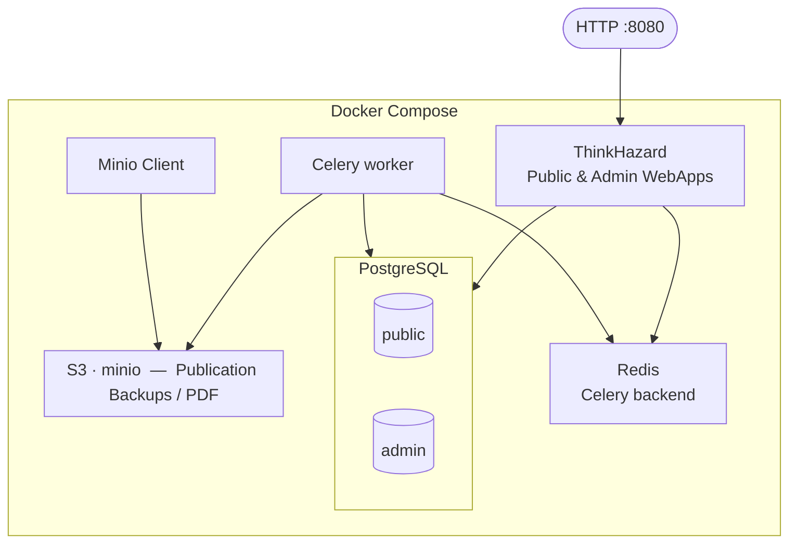
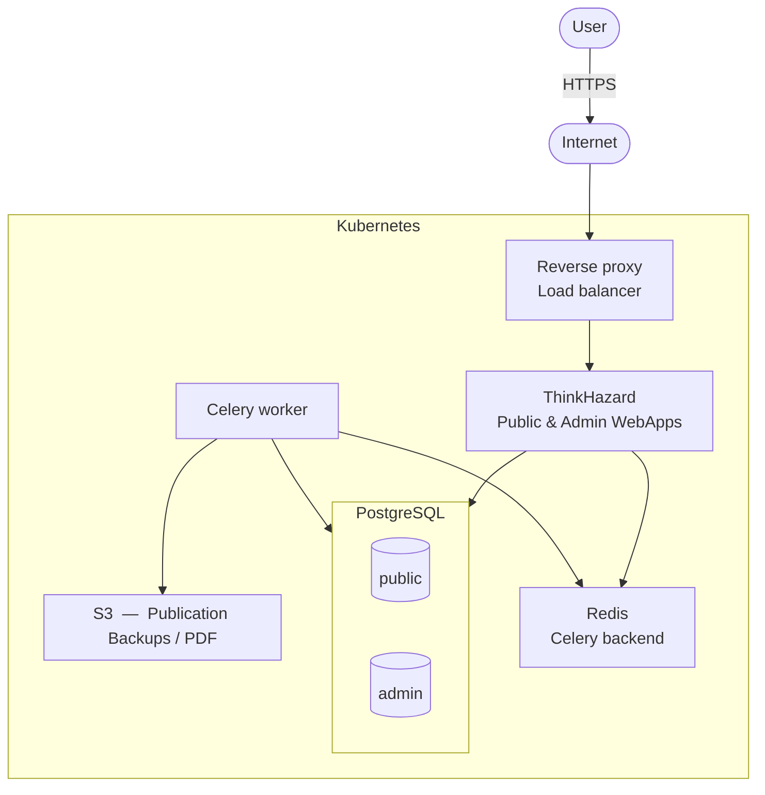

# ThinkHazard!

A natural hazard screening tool for disaster risk management project planning.
ThinkHazard! is maintained by the [Global Facility for Disaster Reduction and Recovery (GFDRR)](https://www.gfdrr.org).

It provides classified hazard levels (very low to high) for any location in the world, along with risk management advice, reports, and contacts for 11 natural hazards.

**Live site:** [thinkhazard.org](http://thinkhazard.org/) &nbsp;|&nbsp; **API docs:** [gfdrr.github.io/thinkhazard/api](https://gfdrr.github.io/thinkhazard/api/) &nbsp;|&nbsp; **License:** GPL-3.0

---

## Table of contents

- [Architecture](#architecture)
- [Getting started](#getting-started)
- [Database setup](#database-setup)
- [GeoNode integration](#geonode-integration)
- [Processing tasks](#processing-tasks)
- [Publication](#publication)
- [Configuration](#configuration)
  - [Admin authentication](#admin-authentication)
  - [Analytics](#analytics)
  - [Feedback](#feedback)
  - [Processing parameters](#processing-parameters)
- [Translations](#translations)
- [Debugging with VS Code](#debugging-with-vs-code)

---

## Architecture

### Development (Docker Compose)

All services run locally inside a single Docker Compose stack. Access the app at `http://localhost:8080`.


```mermaid
flowchart TB
    HTTP(["HTTP :8080"])

    subgraph compose["Docker Compose"]
        direction TB
        APP["ThinkHazard\nPublic & Admin WebApps"]
        REDIS["Redis\nCelery backend"]
        CELERY["Celery worker"]

        subgraph pg["PostgreSQL"]
            PUB[("public")]
            ADM[("admin")]
        end

        subgraph s3["S3 · minio  —  Publication Backups / PDF"]
        end

        MC["Minio Client"]
    end

    HTTP --> APP
    APP --> REDIS
    CELERY --> REDIS
    APP --> pg
    CELERY --> pg
    CELERY --> s3
    MC --> s3
```

| Service | Role |
|---|---|
| **ThinkHazard WebApps** | Public-facing site + admin interface, served on port 8080 |
| **Redis** | Celery message broker and result backend |
| **Celery worker** | Runs async processing tasks (harvest, download, process, publish) |
| **PostgreSQL** | Two schemas: `public` (live site) and `admin` (staging/processing) |
| **S3 · minio** | Local S3-compatible object store for publication backups and PDFs |
| **Minio Client** | CLI tool used to seed or manage the local minio bucket |

### Production (Kubernetes)

Traffic enters through a reverse proxy / load balancer. Object storage uses real AWS S3.


```mermaid
flowchart TB
    USER(["User"])
    INET(["Internet"])

    USER -->|HTTPS| INET

    subgraph k8s["Kubernetes"]
        direction TB
        RP["Reverse proxy\nLoad balancer"]
        APP["ThinkHazard\nPublic & Admin WebApps"]
        REDIS["Redis\nCelery backend"]
        CELERY["Celery worker"]

        subgraph pg["PostgreSQL"]
            PUB[("public")]
            ADM[("admin")]
        end

        subgraph s3["S3  —  Publication Backups / PDF"]
        end
    end

    INET --> RP
    RP --> APP
    APP --> REDIS
    CELERY --> REDIS
    APP --> pg
    CELERY --> pg
    CELERY --> s3
```

| Component | Role |
|---|---|
| **Reverse proxy / Load balancer** | TLS termination, routing, horizontal scaling |
| **ThinkHazard WebApps** | Same image as dev; serves public site + admin interface |
| **Redis** | Celery broker — same role as dev |
| **Celery worker** | Same processing tasks as dev |
| **PostgreSQL** | `public` schema serves the live site; `admin` schema is for processing and publishing |
| **S3** | AWS S3 bucket for publication backups and exported PDFs |

---

## Getting started

> The commands below assume a Debian/Ubuntu system. Adapt as needed for other platforms.

**1. Build Docker images:**

```bash
make build
```

**2. Start the stack and initialise the database:**

```bash
docker compose up -d
make initdb
```

**3. Open the app:**

```
http://localhost:8080
```

**Run checks and automated tests:**

```bash
make check test
```

---

## Database setup

### Install prerequisites

Install the PostgreSQL `unaccent` extension:

```bash
sudo apt install postgresql-contrib
```

In your `postgresql.conf`, set:

```
max_prepared_transactions = 10
```

### Create databases

```bash
sudo -u postgres createdb -O www-data thinkhazard_admin
sudo -u postgres psql -d thinkhazard_admin -c 'CREATE EXTENSION postgis;'
sudo -u postgres psql -d thinkhazard_admin -c 'CREATE EXTENSION unaccent;'

sudo -u postgres createdb -O www-data thinkhazard
sudo -u postgres psql -d thinkhazard -c 'CREATE EXTENSION postgis;'
sudo -u postgres psql -d thinkhazard -c 'CREATE EXTENSION unaccent;'
```

If you need a different user or database name, supply your own configuration file by creating a `local.ini` file based on `development.ini`.

### Populate the schema

```bash
make populatedb
```

> This may take a while. To import only a subset of administrative divisions:
>
> ```bash
> make populatedb DATA=turkey
> # or
> make populatedb DATA=indonesia
> ```

---

## GeoNode integration

To harvest a GeoNode instance with full access, you need a GeoNode API key.

**On the GeoNode side:**

```bash
# Create a superuser
python manage.py createsuperuser

# Generate API keys for all users
python manage.py backfill_api_keys

# Display all API keys
SELECT people_profile.id, username, key
FROM people_profile
LEFT JOIN tastypie_apikey ON (tastypie_apikey.user_id = people_profile.id)
```

**On the ThinkHazard side:**

Update `username` and `api_key` in `thinkhazard_processing.yaml` (located in the tests directory or create one for your deployment).

### Run the data pipeline

Processing tasks are managed through the admin interface or via Celery. See the [Processing tasks](#processing-tasks) section below for detailed command syntax.

---

## Processing tasks

Administrators can run each task individually with additional flags:

```bash
docker compose run --rm thinkhazard harvest [--force] [--dry-run]
```
Harvest metadata from GeoNode; creates HazardSet and Layer records.

```bash
docker compose run --rm thinkhazard download [--title] [--force] [--dry-run]
```
Download raster files into the data folder.

```bash
docker compose run --rm thinkhazard complete [--force] [--dry-run]
```
Identify fully-downloaded hazard sets, infer fields, and mark them complete.

```bash
docker compose run --rm thinkhazard process [--hazardset_id ...] [--force] [--dry-run]
```
Calculate outputs from hazard sets and administrative divisions.

```bash
docker compose run --rm thinkhazard decision_tree [--force] [--dry-run]
```
Apply the decision tree and upscaling to produce final hazard category assignments per administrative division.

---

## Publication

Publication overwrites the public database with the admin database:

```bash
make publish
```

This executes the following steps in order:

1. Lock the public site in maintenance mode
2. Store a publication date in the admin database
3. Back up the admin database to the archives folder
4. Create a fresh public database
5. Restore the admin backup into the public database
6. Unlock the public site from maintenance mode

---

## Configuration

### Admin authentication

Authentication uses the `HTPASSWORDS` environment variable, which should contain usernames and passwords in Apache `htpasswd` format.

Create an `.htpasswd` file with an initial `admin` user:

```bash
htpasswd -c .htpasswd admin
```

Add or update another user:

```bash
htpasswd .htpasswd username2
```

Pass the file contents to the container via the environment:

```yaml
environment:
  HTPASSWORDS: |
    admin:$apr1$...
    username2:$apr1$...
```

### Analytics

To enable Google Analytics, set the tracking ID:

```yaml
environment:
  ANALYTICS: UA-75301865-1
```

### Feedback

Configure the feedback form URL in `production.ini`:

```ini
feedback_form_url = https://...
```

### Processing parameters

Thresholds, return periods, and units for each hazard type are configured in `thinkhazard_processing.yaml`. A reference configuration can be found in the `tests` directory.

> **Note:** Any change to this file causes the next harvest to delete all layers, hazard sets, and processing outputs. A full reprocess will be required, which can take close to an hour.

#### `hazard_types`

One entry per hazard type mnemonic. Supported subkeys:

**`hazard_type`** — corresponding hazard type value in GeoNode.

**`return_periods`** — one entry per hazard level mnemonic. Each value can be a scalar or a `[min, max]` range:

```yaml
return_periods:
  HIG: [10, 25]
  MED: 50
  LOW: [100, 1000]
```

**`thresholds`** — flexible threshold configuration. Simplest form:

```yaml
thresholds: 1700
```

Full form with `global`/`local` splits, per-level, and per-unit:

```yaml
thresholds:
  global:
    HIG:
      unit1: value1
      unit2: value2
    MED:
      unit1: value1
      unit2: value2
    LOW:
      unit1: value1
      unit2: value2
    MASK:
      unit1: value1
      unit2: value2
  local:
    unit1: value1
    unit2: value2
```

**`values`** — use this when the layer is preprocessed. When present, `thresholds` and `return_periods` are ignored:

```yaml
values:
  HIG: [103]
  MED: [102]
  LOW: [101]
  VLO: [100, 0]
```

---

## Translations

ThinkHazard! is translated via [Transifex](https://www.transifex.com).

### Workflow

We use [lingua](https://github.com/GreenSteam/lingua) to extract translation strings from Jinja2 templates.

> The following commands should be run from the **production instance** to ensure database strings are up to date. Make sure `~/.transifexrc` is valid and has the correct credentials.

Extract and push UI translations to Transifex:

```bash
make transifex-push-ui
```

Push database translations to Transifex:

```bash
make transifex-push-db
```

Pull completed translations from Transifex:

```bash
make transifex-pull-db
```

Compile the catalog (`.po` → `.mo`):

```bash
make compile_catalog
```

### Development

There are three ways to translate strings in templates:

**`translate` filter** — for strings from enumeration tables in the database:

```jinja2
{{ hazard.title | translate }}
```

**`gettext` method** — for UI strings:

```jinja2
{{ gettext('Download PDF') }}
```

**Model class method** — for model fields with per-language values:

```jinja2
{{ division.translated_name(request.locale_name) }}
```

---

## Debugging with VS Code

Copy the override sample:

```bash
cp docker-compose.override.sample.yaml docker-compose.override.yaml
```

Then create `.vscode/launch.json`:

```json
{
  "version": "0.2.0",
  "configurations": [
    {
      "name": "Python Debugger: Remote Attach — ThinkHazard",
      "type": "debugpy",
      "request": "attach",
      "connect": { "host": "localhost", "port": 5678 },
      "pathMappings": [{ "localRoot": "${workspaceFolder}", "remoteRoot": "/app" }]
    },
    {
      "name": "Python Debugger: Remote Attach — Taskrunner",
      "type": "debugpy",
      "request": "attach",
      "connect": { "host": "localhost", "port": 5679 },
      "pathMappings": [{ "localRoot": "${workspaceFolder}", "remoteRoot": "/app" }]
    },
    {
      "name": "Python Debugger: Remote Attach — Tests",
      "type": "debugpy",
      "request": "attach",
      "connect": { "host": "localhost", "port": 5680 },
      "pathMappings": [{ "localRoot": "${workspaceFolder}", "remoteRoot": "/app" }]
    }
  ]
}
```
