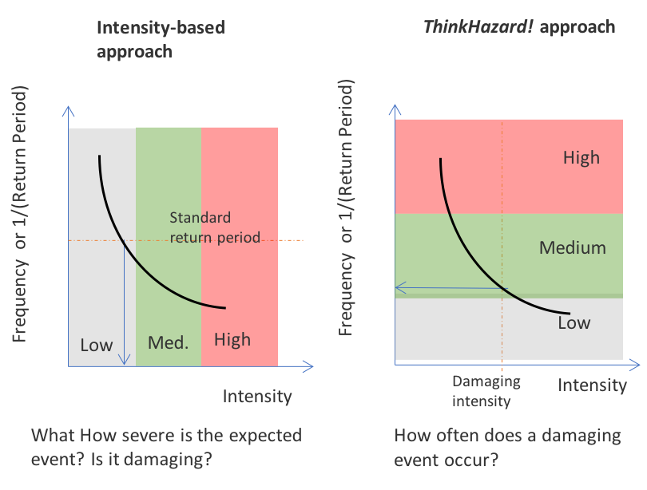
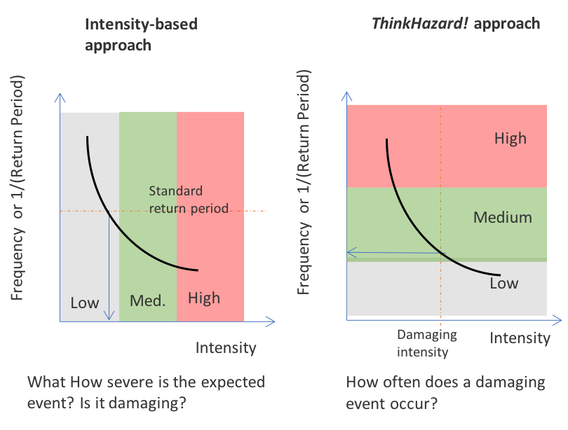

# Hazard Classification

ThinkHazard! classifies 11 natural hazards at the scale of local administrative units (ADM2, which can correspond to a county, a district or a province depending on the country) as High, Medium, Low, and Very Low. Hazard levels are then aggregated to ADM1 (region) and ADM0 (country) unit levels, providing a conservative, aggregated view of hazard.

The four hazard levels are derived from hazard maps presenting the spatial distribution of hazard intensity (e.g., flood depth, ground shaking) at a given frequency, or 'return period' (e.g., Figure below). A hazard map is the visualization of hazard at one point of a frequency-severity curve; the distribution of hazard intensity varies for each frequency. The timeframe considered in classification of each hazard depends on the timescales over which the hazard causal processes operate, and historical data available to assess long-term averages.

```{figure} images/sharemap.png
---
alt: An earthquake hazard map for Europe (from the SHARE project). Hazard is shown as expected peak ground acceleration (PGA) with a 10% chance of being exceeded in a 50-year interval (return period of 475 years)
---
```

## Hazard Levels

Hazard levels can be described as:

- **High** (Score 3): Users should be highly aware of potentially severe damage from this hazard for the project location. Without taking measures to mitigate the hazard and risk, high levels of damage can be expected to occur within the project or human lifetime (and potentially frequently in that timeframe, for hydro-meteorological hazards, e.g., floods, extreme heat).

- **Medium** (Score 2): Users should be aware of potentially damaging effects of this hazard for the project location. Potentially damaging events can be expected to occur within the project or human lifetime and measures to mitigate the hazard and risk should be considered. For hydro-meteorological hazards, damaging effects could occur frequently in that timeframe.

- **Low** (Score 1): Potentially damaging events are less likely to occur within the project or human lifetime but are still possible. Measures to mitigate the hazard and risk would be prudent at critical locations. Hazard has been classified based on long-term averages, and there is still potential that damaging events could occur in this timeframe.

- **Very Low** (Score 0): Available data suggest that potentially damaging effects are unlikely to occur, on average, in the project or human lifetime. Hazard has been classified based on long-term averages, and there is still potential that damaging events could occur in this timeframe.

- **Not Affected** (Score -1): No exposure, below all thresholds, or outside hazard zone.

## Geographic Units

ThinkHazard! performs hazard classification at two geographic levels:

### Administrative Boundaries

A three-tier administrative hierarchy is used:

- **ADM2**: Local units (county, district, or province depending on country) - primary classification level
- **ADM1**: Regional units (state, region, or first-level subdivision)
- **ADM0**: Country level

Administrative boundary data is obtained from the [World Bank Global Administrative Divisions](https://datacatalog.worldbank.org/search/dataset/0038272) FeatureServer service.

### Urban Areas

In addition to administrative boundaries, classification is performed for approximately **3,000 major urban areas** globally (largest cities and chief towns). Urban area boundaries are obtained from the [GHSL Urban Centre Database (UCDB R2024A)](https://human-settlement.emergency.copernicus.eu/download.php?ds=ucdb), which provides standardized urban extent data based on satellite imagery and population data.

This dual approach ensures comprehensive coverage for both administrative planning contexts and urban-focused development projects.

### Aggregating Hazard Levels

Hazard classification is conducted at the ADM2 level. The hazard level of higher-level ADM1 or ADM0 units is defined as the **maximum hazard level** in all lower units that it contains. This aggregation process is intentionally conservative, ensuring that ThinkHazard! shows the maximum hazard in any administrative unit to safeguard against underestimating overall hazard when a large area is selected.

```{figure} images/aggregation.png
---
alt: Principles of hazard level aggregation from ADM2 up to ADM0 (country level)
---
```

## Classification Approach

### Probabilistic Data

ThinkHazard! uses frequency and severity information to communicate how frequently a project location may sustain damage from a hazard. This is a well-defined process for probabilistic data, which provide both elements required for this assessment (estimates of hazard frequency and severity).

To do this, we first identify an intensity level for each hazard, above which damage is expected to occur, and then assess how frequently that intensity might be exceeded. This information is available on frequency-severity curves, which are a product of probabilistic analysis (see figure below). The chosen formulation helps users prioritize and manage multiple hazards with the greatest chance of causing damage to their interests.

Frequency of a hazard intensity being exceeded can be defined in terms of average recurrence interval, or **return period**, expressed as '1 in 100 years', or the '100-year return period'. Alternatively, this can be expressed as the chance of the intensity value being exceeded on an annual basis: for the 100-year return period hazard this would be 1% chance of exceedance in any given year (1.0% = 1/100); for the 500-year return period this is 0.2% (0.2% = 1/500). Longer return periods correspond to having a smaller chance that the damaging intensity will be exceeded during the reference timeframe lifetime, hence the risk of damage is lower.

<div style="text-align: center;">
  
  
</div>

### Key Parameters

All hazard classification uses two fundamental thresholds:

**Value Threshold**: Minimum hazard intensity to count pixels as "affected". This represents the damaging intensity threshold - the intensity above which damage would be expected to occur. Conservative (i.e. low) damage thresholds are used because they are intended to reflect intensity that can cause damage for projects in International Development Association (IDA) countries, in which investments may be more vulnerable.

**Area Threshold**: Minimum percentage of admin unit that must be affected to trigger scoring. Used by ALL hazards to filter out negligible exposures where only a very small portion of the administrative unit is affected.

### Threshold Justification

Most value and area thresholds in this version carry forward the literature review conducted for the original ThinkHazard! v2 methodology (Fraser et al., 2017) — for example, earthquake intensity anchored to the EMS-98 macroseismic intensity–PGA correlation (Atkinson & Sonley, 2000), tsunami's 2.0 m threshold anchored to post-disaster building-damage surveys from the 2011 Japan tsunami (MLIT, 2012), and flood's original depth classes drawn from the RiskMap flood-damage literature (Meyer et al., 2011).

For this update, a small number of thresholds were deliberately adjusted from those original values, for two distinct reasons:

- **To guarantee a meaningful distribution of hazard classes.** Where a threshold inherited from the original literature review was based on a different intensity convention than the current data uses, applying it unadjusted would systematically over- or under-classify hazard. Cyclone is the clearest case: the STORM v4 dataset reports 10-minute sustained wind speed, while damaging-wind thresholds (and the Saffir-Simpson scale specifically) are conventionally expressed in 1-minute sustained wind, which is measurably higher for the same storm. Applying category thresholds unadjusted would understate wind hazard everywhere. Thresholds were converted using STORM's own documented factor (0.8821 — Bloemendaal et al., 2020) and further checked against countries with a known historical record of cyclone impact to confirm the resulting classification wasn't under-capturing real exposure (see Tropical Cyclone, below). Earthquake's refinement from the original 2-tier PGA scheme (0.2 g / 0.1 g) into today's 4-tier, RP-specific scheme (0.12 → 0.06 g) follows the same intent: it keeps the same EMS-98-anchored intensity range, but avoids "High" being awarded too easily by testing the strictest bar at the most frequent return period, the same design principle documented in the original methodology report for the 2-tier version.

  Pluvial flood needed a related but distinct fix. Because flood depth increases monotonically with return period, a *flat* depth/area threshold applied at every RP tends to produce near-simultaneous pass/fail outcomes: once a location's depth clears the bar at one RP, it typically clears it at every rarer RP too, since depth only grows from there. That collapses the score distribution toward the two extremes — Not Affected/Very Low, or High — and leaves the Medium and Low classes with almost no coverage, i.e. the classes effectively overlap into a near-binary outcome. Making the depth and area thresholds *increase* with return period, rather than stay flat, breaks that near-simultaneous pattern: a location can now clear the lenient frequent-RP bar without clearing the stricter rare-RP bar, or the reverse, which spreads real variation across the full 0–4 score range. Geographically, this shows up mainly as increased coverage of the Medium and Low classes specifically, rather than a wholesale redistribution into High.

- **To better match observational records on the ground.** Pluvial flood is the main case: the single depth/area screen calibrated for river and coastal flooding under-detected chronic, shallow urban flooding. Depth and area thresholds were lowered at the frequent return periods specifically to capture this, checked against documented flood history (largely EM-DAT-recorded events) for known chronic-flood megacities, and cross-checked against a negative-control set of hyper-arid reference locations to confirm rare events weren't being reclassified as chronic hazard (see Floods, below).

Where thresholds could not be reconciled against ground-truth records through data alone — a small number of well-documented, frequently-flooded megacities that still scored below their known history even after threshold tuning — a manual, data-level override was applied instead of a further rule change (see Floods, below).

## Classification by Hazard

Below are the specific classification methods and thresholds for each of the 11 hazards covered by ThinkHazard!.

::::{grid} 1

:::{grid-item-card}

## Earthquake

```{image} images/eq.png
:width: 120px
:align: center
:class: hazard-icon
```

**Data Source**: [Earthquake](data-references.md#earthquake) (GAR 2017)

**Return Periods**: RP250, RP475, RP975, RP2475

**Intensity Parameter**: Peak Ground Acceleration (g)

^^^

**Intensity Thresholds** (RP-specific):

| Return Period | Threshold |
|--------------|-----------|
| RP250 | 0.12 g |
| RP475 | 0.10 g |
| RP975 | 0.08 g |
| RP2475 | 0.06 g |

**Area Threshold**: 5%

**Why these thresholds**: intensity is anchored to the EMS-98 macroseismic intensity–PGA correlation (Atkinson & Sonley, 2000) used in the original ThinkHazard! methodology. The threshold decreases at rarer return periods (0.12 g at RP250 down to 0.06 g at RP2475) by design, not because rarer earthquakes are inherently more damaging at low shaking: testing the strictest bar at the most frequent return period keeps High meaningful, so it takes genuinely frequent strong shaking to earn it rather than a theoretical rare extreme. See [Threshold Justification](#threshold-justification) above.

**Scoring Logic**:

| RPs Meeting Threshold | Score | Level |
|----------------------|-------|-------|
| 0 RPs | -1 | Not Affected |
| 1 RP | 0 | Very Low |
| 2 RPs | 1 | Low |
| 3 RPs | 2 | Medium |
| 4 RPs | 3 | High |

:::

:::{grid-item-card}
## Tropical Cyclone / Strong Winds

```{image} images/sw.png
:width: 120px
:align: center
:class: hazard-icon
```
**Data Source**: [Tropical Cyclone / Strong Winds](data-references.md#tropical-cyclone-strong-winds) (STORM v4, Bloemendaal N. 2023)

**Return Periods**: RP50, RP100, RP1000, RP10000

**Intensity Parameter**: Wind Speed (m/s)

^^^

**Intensity Thresholds** (RP-specific):

| Return Period | Threshold |
|--------------|-----------|
| RP50 | 36 m/s (~130 km/h) |
| RP100 | 36 m/s (~130 km/h) |
| RP1000 | 30 m/s (~108 km/h) |
| RP10000 | 26 m/s (~94 km/h) |

**Area Threshold**: 5%

**Why these thresholds**: STORM v4 reports 10-minute sustained wind speed, whereas damaging-wind convention (including the Saffir-Simpson scale) is expressed in 1-minute sustained wind, which runs measurably higher for the same storm. Applying Saffir-Simpson category cutoffs unadjusted would understate cyclone hazard everywhere. Thresholds here were converted using STORM's own documented factor (0.8821 — Bloemendaal et al., *Scientific Data*, 2020) and checked against countries with a known historical record of cyclone impact to confirm real exposure wasn't being under-captured.

**Scoring Logic**:

| RPs Meeting Threshold | Score | Level |
|----------------------|-------|-------|
| 0 RPs | -1 | Not Affected |
| 1 RP | 0 | Very Low |
| 2 RPs | 1 | Low |
| 3 RPs | 2 | Medium |
| 4 RPs | 3 | High |

:::

:::{grid-item-card}

## Floods (River / Pluvial / Coastal)

```{image} images/fl.png
:width: 120px
:align: center
:class: hazard-icon
```

**Data Source**: [Floods (Fluvial, pluvial, coastal)](data-references.md#floods-fluvial-pluvial-coastal) (Fathom v3)

**Return Periods**: RP10, RP100, RP500, RP1000

**Intensity Parameter**: Inundation depth (meters)

^^^

**Intensity and Area Thresholds** (RP-specific, and different for pluvial than for river/coastal):

| Return Period | River & Coastal — Depth | River & Coastal — Area | Pluvial — Depth | Pluvial — Area |
|--------------|:-----------------------:|:-----------------------:|:----------------:|:---------------:|
| RP10 | 0.2 m | 3% | 0.1 m | 0.3% |
| RP100 | 0.2 m | 3% | 0.1 m | 0.3% |
| RP500 | 0.5 m | 3% | 0.5 m | 3% |
| RP1000 | 0.5 m | 3% | 0.5 m | 3% |

A return period "counts" when **both** its depth and area thresholds are met; the score is the number of return periods that count (0-4), mapped to the -1..3 scale below.

**Area threshold definition (unconditioned)**: for floods, the area threshold is evaluated against the percentage of the unit with *any* inundation present, independent of the depth threshold — not, as elsewhere in ThinkHazard!, the percentage of the unit *above* the depth threshold. This is a deliberate relaxation specific to flood hazard: conditioning area on depth as well would let a unit with real but spatially patchy inundation (wet in many places, but only deep in a few) fail the area test outright, so flood instead asks the two questions separately - *is enough of the unit wet at all* (area), and separately, *when it is wet, is it deep enough to matter* (depth) - which keeps the flood score conservative rather than risking an under-count. Every other hazard in ThinkHazard! (earthquake, cyclone, extreme heat, tsunami, wildfire) conditions its area percentage on the value threshold; flood is the intentional exception.

**Why pluvial differs from river and coastal**: a single 0.5 m / 3% screen, calibrated on river and coastal flooding, under-detects pluvial (surface-water) flooding, which is characteristically shallow and frequent rather than deep and rare. A flat threshold also produces a near-binary score pattern (see [Threshold Justification](#threshold-justification) above): once depth clears the bar at one RP it tends to clear it at all rarer RPs too, since depth only increases with RP, leaving the Medium and Low classes nearly empty. Lowering the depth and area thresholds at the frequent return periods (RP10, RP100) breaks that pattern and captures the chronic, shallow hazard, which geographically shows up as broader Medium/Low coverage. The rarer return periods (RP500, RP1000) are deliberately left at the original 0.5 m / 3% bar: relaxing them further would also re-classify naturally rare, locally intense events (e.g., desert flash floods) as chronic hazard — confirmed against a negative-control set of hyper-arid reference locations, all of which stayed correctly classified as Not Affected / Very Low under the thresholds above.

**Manual Overrides**: a small number of urban areas with well-documented, frequent pluvial flooding that the automated classification still under-detects (Dhaka, Manila, Mumbai) are set to High by expert judgement rather than by the automated rule. This is recorded as a data-level exception, not a change to the scoring logic, and is expected to be revisited if a data source better suited to shallow, chronic urban flooding becomes available.

**Scoring Logic**:

| RPs Meeting Threshold | Score | Level |
|----------------------|-------|-------|
| 0 RPs | -1 | Not Affected |
| 1 RP | 0 | Very Low |
| 2 RPs | 1 | Low |
| 3 RPs | 2 | Medium |
| 4 RPs | 3 | High |

:::

:::{grid-item-card}

## Tsunami

```{image} images/ts.png
:width: 120px
:align: center
:class: hazard-icon
```

**Data Source**: [Tsunami](data-references.md#tsunami) (GTM network 2017)

**Return Periods**: RP100, RP500, RP2500

**Intensity Parameter**: Inundation depth (meters)

^^^

**Intensity Thresholds** (RP-specific):

| Return Period | Threshold |
|--------------|-----------|
| RP100 | 2.0 m |
| RP500 | 1.0 m |
| RP2500 | 0.5 m |

**Area Threshold**: 0% (any inundation counts)

**Special Processing**: Uses **majority** (most common) inundation depth per unit rather than mean. The majority value must meet the RP-specific threshold AND the area threshold must be met.

**Scoring Logic**:

| Condition | Score | Level |
|-----------|-------|-------|
| No inundation data | -1 | Not Affected |
| Has data but 0 RPs meet thresholds | 0 | Very Low |
| 1 RP meets thresholds | 1 | Low |
| 2 RPs meet thresholds | 2 | Medium |
| 3 RPs meet thresholds | 3 | High |

:::

:::{grid-item-card}

## Wildfire

```{image} images/wf.png
:width: 120px
:align: center
:class: hazard-icon
```

**Data Source**: [Wildfire](data-references.md#wildfire) (CEMS 2020)

**Return Periods**: RP5, RP25, RP50

**Intensity Parameter**: Fire Weather Index (FWI)

^^^

**Intensity Threshold**: 50 FWI (same across all RPs)

**Area Threshold**: 20% (higher than most hazards due to spatial characteristics)

**Special Check**: Area with FWI > 0 must exceed 20% in at least one RP to be considered affected.

**Scoring Logic**:

| Condition | Score | Level |
|-----------|-------|-------|
| Area with FWI > 0 below 20% in ALL RPs | -1 | Not Affected |
| 0 RPs exceed FWI 50 | 0 | Very Low |
| 1 RP exceeds FWI 50 | 1 | Low |
| 2 RPs exceed FWI 50 | 2 | Medium |
| 3 RPs exceed FWI 50 | 3 | High |

:::

:::{grid-item-card}

## Extreme Heat

```{image} images/et.png
:width: 120px
:align: center
:class: hazard-icon
```

**Data Source**: [Extreme Heat](data-references.md#extreme-heat) (GFDRR-VITO 2025)
**Return Periods**: RP5, RP20, RP100
**Intensity Parameter**: Wet Bulb Globe Temperature (°C)

^^^

**Intensity Thresholds** (RP-specific, hierarchical):

| Return Period | Threshold |
|--------------|-----------|
| RP5 | > 32°C WBGT |
| RP20 | > 28°C WBGT |
| RP100 | > 25°C WBGT |

**Area Threshold**: 30% (reflects that heat affects large areas)

**Scoring Logic**:

| Qualifying RP | Score | Level |
|--------------|-------|-------|
| None qualify | 0 | Very Low |
| RP100 qualifies | 1 | Low |
| RP20 qualifies | 2 | Medium |
| RP5 qualifies | 3 | High |

*This prioritizes near-term, likely heat stress over rare events.*

:::

:::{grid-item-card}

## Landslides

```{image} images/ls.png
:width: 120px
:align: center
:class: hazard-icon
```

**Data Source**: [Landslides](data-references.md#landslides) (UNEP/GIRI 2025)

**Data Type**: Single categorical index raster with classes 1-5

^^^

**Intensity Threshold**: Not used (area-based only)

**Area Threshold**: 2%

**Scoring Logic**:

| Landslide Index | Score | Level |
|----------------|-------|-------|
| Index 1 | -1 | Not Affected |
| Index 2 | 0 | Very Low |
| Index 3 | 1 | Low |
| Index 4 | 2 | Medium |
| Index 5 | 3 | High |

:::

:::{grid-item-card}

## Volcanic Eruption

```{image} images/va.png
:width: 120px
:align: center
:class: hazard-icon
```

**Data Source**: [Volcanic Eruption](data-references.md#volcanic-eruption) (NOAA 2025)

**Data Type**: Vector polygon data (VEI-proportional buffer zones)

^^^

**Intensity Threshold**: Not used (area-based only)

**Area Threshold**: 3%

**Processing Steps**:
1. Perform spatial intersection with admin units
2. If no intersection → Score -1 (outside volcano hazard zone)
3. Calculate intersection area as percentage of admin unit
4. Find maximum VEI where area ≥ 3%
5. Remap VEI to score

**Scoring Logic**:

| VEI Range | Score | Level |
|-----------|-------|-------|
| VEI < 2 | -1 | Not Affected |
| VEI 2-3 | 0 | Very Low |
| VEI 3-4 | 1 | Low |
| VEI 4-5 | 2 | Medium |
| VEI > 5 | 3 | High |

:::

:::{grid-item-card}

## Water Scarcity / Drought

```{image} images/ws.png
:width: 120px
:align: center
:class: hazard-icon
```

**Data Source**: [Water Scarcity / Drought](data-references.md#water-scarcity-drought) (RWI Baseline Water Stress)

**Data Type**: Baseline Water Stress (BWS) index [-1, 4]

^^^

**Intensity Threshold**: Not used (direct mapping)

**Area Threshold**: Not specified (uses aggregated index values)

**Scoring Logic**: Direct mapping of BWS index values, aggregating the two lowest classes:

| BWS Index | Score | Level |
|-----------|-------|-------|
| -1 | -1 | Not Affected (desertic areas) |
| 0 | 0 | Very Low |
| 1 | 0 | Very Low |
| 2 | 1 | Low |
| 3 | 2 | Medium |
| 4 | 3 | High |

:::

::::

## Summary Tables

### Intensity Parameters and Thresholds

| Hazard | Intensity Parameter | Unit | Value Threshold(s) |
|--------|---------------------|------|-------------------|
| Earthquake | Peak Ground Acceleration | g | RP-specific: 0.12, 0.10, 0.08, 0.06 |
| Cyclone | Wind Speed | m/s | RP-specific: 36, 36, 30, 26 |
| River (Fluvial) Flood | Inundation Depth | m | RP-specific: 0.2, 0.2, 0.5, 0.5 |
| Pluvial Flood | Inundation Depth | m | RP-specific: 0.1, 0.1, 0.5, 0.5 |
| Coastal Flood | Inundation Depth | m | RP-specific: 0.2, 0.2, 0.5, 0.5 |
| Tsunami | Inundation Depth | m | RP-specific: 2.0, 1.0, 0.5 |
| Wildfire | Fire Weather Index | FWI | 50 |
| Extreme Heat | WBGT Temperature | °C | RP-specific: 32, 28, 25 |
| Landslide | Susceptibility Index | class | Area-based only |
| Volcano | Volcano Explosivity Index | index | Index remap |
| Water Scarcity | Baseline Water Stress | Index | Index remap |

### Return Periods Used

| Hazard | Return Periods | Area Threshold |
|--------|---------------|----------------|
| Earthquake | 250, 475, 975, 2475 years | 5% |
| Cyclone | 50, 100, 1000, 10000 years | 5% |
| River (Fluvial) Flood | 10, 100, 500, 1000 years | 3% |
| Pluvial Flood | 10, 100, 500, 1000 years | RP-specific: 0.3%, 0.3%, 3%, 3% |
| Coastal Flood | 10, 100, 500, 1000 years | 3% |
| Tsunami | 100, 500, 2500 years | 0% |
| Wildfire | 5, 25, 50 years | 20% |
| Extreme Heat | 5, 20, 100 years | 30% |
| Landslide | N/A (index-based) | 2% |
| Volcano | N/A (vector-based) | 3% |
| Water scarcity | N/A (vector-based) | Majority |

## Data Sources

For detailed information about the data sources used for each hazard, please see the [Data Sources](data-references.md) page.
