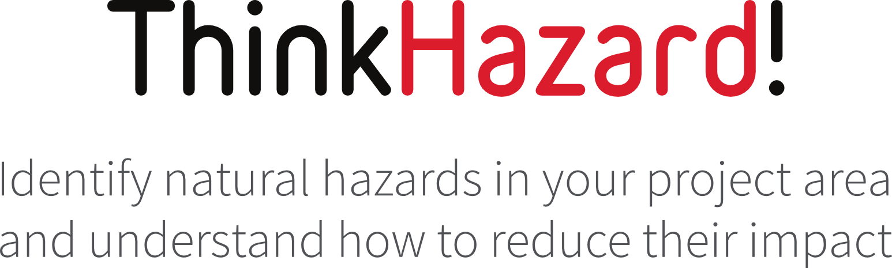
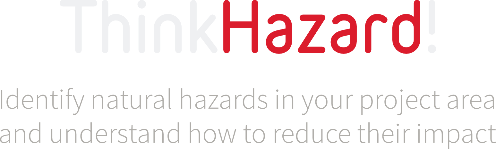

# Documentation for

<div style="text-align: center;">
  
  
</div>

## Objectives

The correct interpretation of any hazard information to determine the potential impacts and thus implement a robust risk management strategy often requires specific data knowledge and technical skills. Additionally, hazard data are generated in many different formats from different sources and made available via a growing number of online sources and data portals. Because of this, the task to find, interprete and elaborate proper hazard datasets can require a large amount of time and prior knowledge basis. As a result, DRM projects do not always cover the full range of hazard categories and intensities. This can lead to an underestimation of disaster risk and undermine the robustness of the project development.

ThinkHazard! is an analytical tool dedicated to improving knowledge and understanding of natural hazards. The primary users are development sector professionals, who need to gather hazard information while planning projects. However, the benefits of ThinkHazard! stretch beyond the development sector, into general education about global distribution of multiple hazards and how to manage them.

ThinkHazard! is developed and maintained by the Global Facility for Disaster Reduction and Recovery [**(GFDRR Labs)**](http://gfdrr.org).

Version 1 of ThinkHazard! was used over 140,000 times in 200 countries, and has been adopted into World Bank Operations Portal for core use in project planning.

```{admonition} Getting Started
:class: tip

ThinkHazard! can be accessed at: [www.thinkhazard.org](http://thinkhazard.org). The online user interface has a simple structure comprising, 1) a location search function, 2) an overview of hazard level for 11 hazards for a selected location, and 3) a hazard-specific screen that presents risk management guidance, relevant contact information and further information in the form of useful websites and reports for that hazard and location.

Begin typing your location of interest (country name, region or district) and select the correct location from the drop-down. Hit enter, and you will be taken to the overview of hazards for that location. From there, you can view more detail on any of the hazards (including guidance on reducing risk, useful resources and contacts), and you can navigate to more specific and neighboring locations using the map.

```{figure} images/thscreens.png
:width: 100%
:align: center
:alt: The three page levels of thinkhazard.org

The three page levels of thinkhazard.org. From left: homepage location search, location overview of all hazards, single hazard level and risk reduction recommendations
```

## Source code

ThinkHazard! uses open-source code, available at [on GitHub](https://github.com/GFDRR/thinkhazard).

Forked versions can be developed using the open-source code as a basis, by including new recommendations and branding. Further, new functionality can be developed as required, and the tool linked to different data repositories. Versions specific to an organization or sector can be developed using this code to provide coverage of particular hazards, or to tailor recommendations more specifically to sector requirements. Sector-specific versions of the tool may have damage thresholds tailored to that sector, for example, using construction standards for critical facilities to determine the intensity of event that could be considered damaging.

## Feedback

User feedback is a vital component of ongoing improvements and updates to ThinkHazard!. Users are able to provide feedback on any topic concerning the tool, via the feedback form available on the user interface. Feedback is delivered to the administrator, who will action any required changes and log requests for new features. If the feedback concerns new data for use in the tool, the administrator will follow up to review the data suitability for ThinkHazard!.

## Geographic Coverage

ThinkHazard! provides hazard classification at two geographic levels:

1. **Administrative boundaries**: Classification is performed for ADM0 (country), ADM1 (region), and ADM2 (district/county) levels globally, using boundaries from the [World Bank Global Administrative Divisions](https://datacatalog.worldbank.org/search/dataset/0038272) service.

2. **Urban areas**: In addition to administrative boundaries, classification is performed for approximately 3,000 major urban areas globally (largest cities and chief towns), using the [GHSL Urban Centre Database (UCDB R2024A)](https://human-settlement.emergency.copernicus.eu/download.php?ds=ucdb).

This dual approach ensures comprehensive coverage for both administrative planning and urban-focused development projects.
